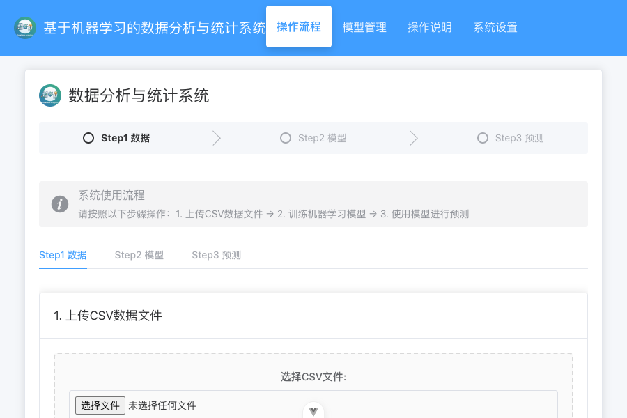

# 基于机器学习的数据分析与统计系统

<p align="center">
  
</p>

一个完整的前后端分离的机器学习数据分析平台，提供数据上传、模型训练和预测功能，支持多种机器学习回归模型。

## 🌟 项目简介

本项目是一个基于机器学习的数据分析与统计系统，实现了完整的数据分析流程：数据上传 → 模型训练 → 预测结果。系统采用前后端分离架构，包含三个主要模块：

- **前端**：基于Vue3 + TypeScript + Element Plus的现代化用户界面
- **后端**：基于GoFrame v2框架的RESTful API服务
- **机器学习模块**：基于Python + FastAPI的机器学习模型服务

用户可以通过简单的界面操作完成数据上传、预处理、模型训练、评估和预测等任务，无需编写代码即可使用机器学习技术进行数据分析。

## 🚀 系统架构

```
基于机器学习的数据分析与统计系统
├── frontend/          # Vue3前端应用
├── backend/           # GoFrame后端服务
└── ml_model/          # Python机器学习API服务
```

### 技术栈

#### 前端
- **框架**: Vue 3.5.26
- **UI组件**: Element Plus 2.13.0
- **状态管理**: Pinia 3.0.4
- **路由管理**: Vue Router 4.6.4
- **HTTP客户端**: Axios 1.13.2
- **开发语言**: TypeScript
- **构建工具**: Vite 7.3.0

#### 后端
- **框架**: GoFrame v2.9.7
- **语言**: Go 1.24+
- **架构**: 分层架构（Controller -> Logic -> HTTP Client -> Python ML API）

#### 机器学习模块
- **框架**: FastAPI
- **机器学习**: Scikit-learn
- **数据处理**: Pandas, NumPy
- **数据可视化**: Matplotlib, Seaborn
- **Web服务**: Uvicorn
- **配置管理**: Pydantic

## 📋 功能特性

### 📊 数据处理
- 支持CSV格式数据文件上传
- 自动数据分析和预览
- 灵活的缺失值处理策略（删除、均值填充、中位数填充、众数填充）
- 智能识别数值列和分类列
- 数据概要生成和异常值检测

### 🤖 模型训练
- 支持多种回归模型：
  - 线性回归
  - 岭回归
  - Lasso回归
  - 弹性网络
  - 随机森林
  - 梯度提升
  - 支持向量回归
  - 决策树
  - K近邻
- 可调节测试集比例
- 支持超参数自动调优
- 详细的模型评估指标展示
- 模型性能比较功能

### 🔮 预测功能
- 单条数据预测
- 批量数据预测
- 预测结果导出（CSV、Excel、JSON格式）
- 实时预测结果显示

### 💾 模型管理
- 本地模型存储
- 模型导入/导出功能
- 模型详情查看
- 模型使用历史记录

### ⚙️ 系统设置
- 自定义主题颜色
- 表格显示设置
- 默认模型配置
- 系统状态监控

## 🛠️ 快速开始

### 环境要求

- Node.js ^20.19.0 || >=22.12.0
- Go 1.24+
- Python 3.8+（推荐使用Python 3.13）
- npm 或 yarn

### 安装与运行

#### 1. 克隆项目

```bash
git clone <repository-url>
cd DataAnalysisFinalProject
```

#### 2. 启动机器学习服务

```bash
cd ml_model
uv sync  # 或 pip install -e .
python run.py
```

服务启动后，可通过 http://localhost:8000 访问API文档

#### 3. 启动后端服务

```bash
cd backend
go mod download
go run main.go
```

服务启动后，可通过 http://localhost:8080 访问后端API

#### 4. 启动前端应用

```bash
cd frontend
npm install
npm run dev
```

应用启动后，可通过 http://localhost:5173 访问前端界面

## 📖 使用指南

### 基本流程

1. **数据上传**：在"操作流程"页面上传CSV格式的数据文件
2. **数据处理**：选择目标列和缺失值处理方式，处理数据
3. **模型训练**：选择合适的模型类型，配置参数并开始训练
4. **模型评估**：查看训练结果和评估指标
5. **数据预测**：使用训练好的模型进行预测
6. **结果导出**：导出预测结果为所需格式

### 数据上传要求

- 文件格式：CSV
- 文件大小：建议不超过10MB
- 数据要求：包含表头，数值列不包含非数字字符

### 模型选择建议

- **线性回归**：适用于线性关系明显的数据集
- **随机森林**：适用于复杂非线性关系，鲁棒性好
- **梯度提升**：适用于高精度要求的场景
- **支持向量回归**：适用于中小型数据集

## 🔗 API接口

### 后端API

#### 数据管理API
- `POST /data/upload` - 上传CSV数据文件
- `GET /data/info` - 获取数据信息
- `GET /data/preview` - 获取数据预览
- `POST /data/process` - 处理数据

#### 模型管理API
- `POST /model/train` - 训练模型
- `GET /model/available` - 获取可用模型
- `GET /model/trained` - 获取已训练模型
- `GET /model/metrics/{model_name}` - 获取模型指标
- `POST /model/compare` - 比较模型
- `GET /model/info` - 获取模型信息

#### 预测服务API
- `POST /predict` - 单条预测
- `POST /predict/batch` - 批量预测
- `POST /predict/export` - 导出预测结果

#### 系统管理API
- `GET /` - 根路径，返回API信息
- `GET /system/status` - 获取系统状态

### 机器学习API

详细API文档请访问：http://localhost:8000/docs

## 📁 项目结构

```
DataAnalysisFinalProject/
├── frontend/                    # Vue3前端应用
│   ├── src/
│   │   ├── components/         # 组件目录
│   │   │   ├── model/         # 模型管理组件
│   │   │   └── workflow/      # 工作流组件
│   │   ├── router/            # 路由配置
│   │   ├── services/          # API服务
│   │   ├── stores/            # 状态管理
│   │   ├── utils/             # 工具函数
│   │   └── views/             # 页面视图
│   └── package.json
├── backend/                    # GoFrame后端服务
│   ├── api/                   # API接口定义
│   ├── internal/              # 内部实现
│   │   ├── controller/        # 控制器层
│   │   ├── logic/             # 业务逻辑层
│   │   └── service/           # 服务层
│   ├── manifest/              # 部署配置
│   └── go.mod
└── ml_model/                   # Python机器学习服务
    ├── api/                   # API接口模块
    ├── data/                  # 数据处理模块
    ├── models/                # 模型训练和预测模块
    ├── config/                # 配置模块
    └── utils/                 # 工具函数模块
```

## 🧪 测试

### 前端测试

```bash
cd frontend
npm run test
```

### 后端测试

```bash
cd backend
make test
```

### 机器学习API测试

```bash
cd ml_model
python test_api.py
python test_prediction.py
```

## 📸 系统截图

### 主界面 - 操作流程


## 🔧 开发指南

### 前端开发

```bash
cd frontend
npm install
npm run dev
```

### 后端开发

```bash
cd backend
go mod download
go run main.go
```

使用Makefile命令：
```bash
make build    # 构建项目
make run      # 运行项目
make fmt      # 格式化代码
make vet      # 代码检查
make test     # 运行测试
```

### 机器学习API开发

```bash
cd ml_model
uv sync
python run.py --debug
```

## 🐛 常见问题

### 数据上传失败
- 检查文件格式是否为CSV
- 确认文件大小不超过限制
- 验证数据格式是否正确

### 模型训练失败
- 确保已选择目标列
- 检查数据是否已完成处理
- 验证目标列是否为数值型

### 预测结果异常
- 确认已训练模型
- 检查输入特征是否完整
- 验证特征值是否在合理范围内

## 📄 许可证

本项目采用MIT许可证 - 查看[LICENSE](LICENSE)文件了解详情。

## 🙏 致谢

感谢以下开源项目：
- [Vue.js](https://vuejs.org/) - 渐进式JavaScript框架
- [GoFrame](https://goframe.org/) - 强大的Go应用开发框架
- [FastAPI](https://fastapi.tiangolo.com/) - 现代化的Python Web框架
- [Scikit-learn](https://scikit-learn.org/) - 机器学习库

## 📞 联系方式

如有问题或建议，请通过Issue联系我们。

---

**注意**: 预测结果仅供参考，不构成决策建议。在使用预测结果进行重要决策前，请咨询相关领域的专业人士。